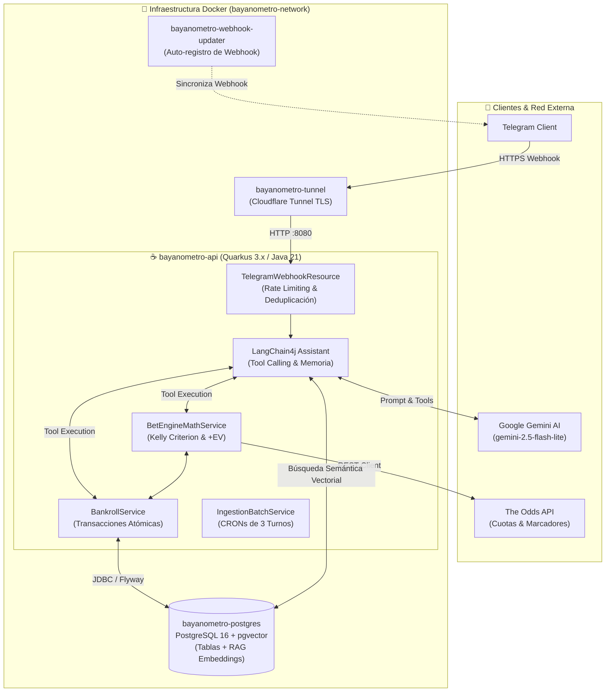

# Bayanómetro 🎲📊

[](https://openjdk.org/)
[](https://quarkus.io/)
[](https://github.com/pgvector/pgvector)
[](https://docs.langchain4j.dev/)
[](https://sonarqube.org/)
[](LICENSE)

> **Asistente Cuantitativo Autónomo de Apuestas y Gestión de Riesgo Financiero (Bankroll Management)**  
> Desarrollado en **Java 21** con **Quarkus 3.x**, **LangChain4j**, **RAG vectorial con pgvector** y orquestación multi-contenedor en **Docker**.

---

## 📌 Descripción del Proyecto

**Bayanómetro** es un sistema backend de grado empresarial diseñado para transformar el análisis deportivo intuitivo en un **proceso estricto de ingeniería cuantitativa y gestión de riesgo**.

Opera de forma autónoma mediante un **Bot de Telegram seguro (whitelist)** que asiste al usuario calculando apuestas con **Valor Esperado Positivo (+EV)**, determinando tamaños óptimos de postura mediante el **Criterio de Kelly fraccional**, previniendo la quiebra con colchones de varianza y conciliando automáticamente las apuestas terminadas contra proveedores oficiales de cuotas.

---

## 🏛️ Arquitectura del Sistema



---

## 🚀 Desafíos Técnicos y Decisiones de Ingeniería

### 1. Gestión de Riesgo Financiero & Kelly Criterion
* **Cálculo de Fracción Óptima:** Implementación de la fórmula de Kelly:
  $$\mathbf{f^* = \frac{bp - q}{b}}$$
  donde $b$ es la cuota decimal neta ($cuota - 1$), $p$ es la probabilidad estimada y $q = 1 - p$.
* **Protección Anti-Quiebra:** Reserva obligatoria porcentual del capital como colchón contra rachas de varianza negativa y bloqueo preventivo de operaciones de riesgo si el balance desciende por debajo del umbral mínimo de seguridad parametrizado.

### 2. RAG Semántico In-Process con pgvector
* **Cero Coste de Embeddings:** En lugar de pagar por APIs de embeddings, el sistema ejecuta embeddings locales *in-process* mediante **ONNX Runtime (`all-MiniLM-L6-v2`, 384 dimensiones)**.
* **Persistencia Vectorial:** Almacenamiento e indexación de documentos de teoría cuantitativa (Poisson, Closing Line Value, Dutching, Falacias del Apostador) en **PostgreSQL con la extensión `pgvector`**.

### 3. Aislamiento Transaccional JTA vs. LLM Streaming
* **El Problema:** Mantener una transacción de base de datos abierta mientras un LLM procesa una respuesta (20-60 segundos) provoca bloqueos de conexión y cancelaciones por el `TransactionReaper` de Narayana.
* **La Solución:** Separación en fases atómicas:
  1. Deduplicación y validación de rate limit en transacción corta (`TelegramWebhookTxHelper`).
  2. Ejecución del modelo de IA **fuera de contexto transaccional**.
  3. Ejecución de mutaciones contables (descuento de saldo o cobro de premios) en transacciones atómicas dedicadas con reintentos (`@Retry(retryOn = OptimisticLockException.class)`).

### 4. Resiliencia & Optimización de Cuotas API
* **Smart Sport Filtering:** La conciliación analiza únicamente los deportes donde el usuario tiene boletos pendientes, reduciendo el consumo de peticiones a The Odds API en más de un **80%**.
* **Caché en Memoria:** Caché de resultados deportivos con TTL de 15 minutos implementada con estructuras de datos concurrentes.

---

## 🛠️ Stack Tecnológico

| Capa | Tecnología | Propósito |
| :--- | :--- | :--- |
| **Lenguaje** | **Java 21 LTS** | Records, Virtual Threads ready, Pattern Matching. |
| **Framework** | **Quarkus 3.39.4** | Framework cloud-native de arranque ultrarrápido y bajo consumo de RAM. |
| **Inteligencia Artificial** | **LangChain4j + Google Gemini** | Orquestación de LLMs, memoria de chat con Caffeine y Tool Calling tipado. |
| **Base de Datos** | **PostgreSQL 16 + pgvector** | Persistencia transaccional ACID y búsqueda por similitud de cosenos. |
| **Migraciones** | **Flyway** | Control de versiones reproducible del esquema de base de datos. |
| **Contenedores** | **Docker & Docker Compose** | Multi-Stage Build con usuario sin privilegios (`non-root`). |
| **Redes & TLS** | **Cloudflare Tunnel** | Exposición segura a internet con HTTPS sin abrir puertos en router. |
| **Calidad & Tests** | **JUnit 5, Mockito, Rest-Assured, JaCoCo** | Pruebas unitarias de cobertura matemática y pruebas de integración. |

---

## 🧪 Pruebas Unitarias y Cobertura (JaCoCo)

El proyecto cuenta con una suite de pruebas automatizadas que verifican la lógica crítica sin dependencias externas:

```bash
# Ejecutar suite de pruebas con generación de reporte JaCoCo
./mvnw clean test
```

* **`MathUtilsTest`:** 100% de cobertura de ramas para el cálculo del Criterio de Kelly, control de números nulos y redondeo bancario.
* **`GlobalExceptionMapperTest`:** Validación de respuestas JSON estructuradas para errores 400, 403, 429 y 500.
* **`BankrollAdminResourceTest`:** Pruebas de seguridad con Mockito sobre validación de tokens y parámetros obligatorios.
* **`TelegramWebhookResourceTest`:** Pruebas REST-assured de autenticación de webhooks y rate limiting.

El reporte XML se genera en: `target/site/jacoco/jacoco.xml`.

---

## 🚀 Despliegue y Ejecución Local

### Prerrequisitos
* **Docker Desktop** (con soporte para WSL2 en Windows) o Docker Engine en Linux.
* **Java 21** y **Maven 3.9+** (opcional si se usa el wrapper `./mvnw`).

### 1. Clonar y Configurar Variables de Entorno
Copia la plantilla de entorno:
```bash
cp .env.example .env
```

Configura tus credenciales en `.env`:
```env
TELEGRAM_BOT_TOKEN=tu_token_de_botfather
TELEGRAM_WEBHOOK_SECRET=tu_secreto_hexadecimal
TELEGRAM_ALLOWED_USERS=tu_id_telegram
THE_ODDS_API_KEY=tu_api_key_de_the_odds_api
GEMINI_API_KEY=tu_api_key_de_google_ai_studio
```

### 2. Iniciar con Docker Compose
Puedes levantar los 4 contenedores automáticamente:
```bash
docker compose up --build -d
```
*(En Windows también puedes hacer doble clic en `iniciar-bayanometro.bat` para ver los logs en vivo).*

### 3. Verificar Servicios
```bash
docker compose ps
```
* **PostgreSQL:** Saludable en `localhost:5432`.
* **Quarkus API:** Escuchando en `localhost:8080`.
* **Swagger UI:** Accesible en dev mode en `http://localhost:8080/q/swagger-ui/`.
* **Tunnel:** Conectado a la red Cloudflare y registrado en Telegram automáticamente.

---

## 📄 Licencia

Este proyecto está bajo la Licencia **Apache 2.0**. Consulta el archivo [LICENSE](LICENSE) para más detalles.
